# Blue Information Technology Website

## Project Description

This project is part of the Blue Information Technology Full-Stack Training Program.

The website was built using semantic HTML, responsive CSS, and vanilla JavaScript while following accessibility best practices and clean code organization.

---

## Technologies and Tools Used

- HTML5
- CSS3
- JavaScript (Vanilla JS)
- Visual Studio Code
- Git
- GitHub

---

## Project Folder Structure

```text
task-01-responsive-website/
│
├── index.html
├── css/
│   └── style.css
├── js/
│   └── main.js
├── images/
│   ├── blue.png
│   ├── desktop-preview-1.png
│   ├── desktop-preview-2.png
│   ├── tablet-preview-1.png
│   ├── tablet-preview-2.png
│   ├── tablet-preview-3.png
│   ├── mobile-preview-1.png
│   ├── mobile-preview-2.png
│   ├── mobile-preview-3.png
│   ├── formValidation1.png
│   ├── formValidation2.png
│   ├── formValidation3.png
│   └── ActiveNavigationAndBacktoTop.png
└── README.md
```

---

## How to Run the Project

1. Clone the repository.

```bash
git clone <repository-url>
```

2. Open the project using Visual Studio Code.

3. Open `index.html` in your browser.

---

# Task Summary

## Task 01

- Environment setup.
- Git repository initialization.
- GitHub repository creation.
- Semantic HTML structure.
- HTML5 semantic elements.

---

## Task 02

- CSS architecture created.
- CSS variables and reset implemented.
- Typography and base styles added.
- Desktop layout completed.
- Header, navigation, hero, about, services, statistics, contact form, and footer styled.

---

## Task 03

- Responsive layout implemented using Media Queries.
- Desktop, Tablet and Mobile support.
- Responsive Services and Statistics sections.
- Accessible mobile navigation menu.
- Keyboard accessible navigation.
- Mobile menu closes after navigation.
- Cross-device testing completed.

---

## Task 04

### JavaScript

- Organized JavaScript into reusable initialization functions.
- Mobile navigation interactions.
- Contact form validation.
- Live input validation.
- Blur validation.
- Character counter.
- Success message.
- Back-to-top button.
- Active navigation using Intersection Observer.
- Animated statistics counters.
- Reduced motion support.
- Defensive DOM element checks.

### Form Validation

- Required field validation.
- Name validation (2–60 characters).
- Email validation.
- Optional phone validation.
- Subject validation.
- Message validation (10–500 characters).
- Focus on the first invalid field.
- Prevent form submission when validation fails.
- Reset form after successful submission.

### Accessibility

- aria-label
- aria-controls
- aria-expanded
- aria-describedby
- aria-invalid
- aria-live
- Keyboard accessible interactions

---

# Design Approach

- Semantic HTML5.
- CSS Variables.
- CSS Grid.
- Responsive Design.
- Mobile-first responsive behavior.
- Vanilla JavaScript.
- Reusable helper functions.
- Accessibility-focused implementation.

---

# Responsive Preview

## Desktop

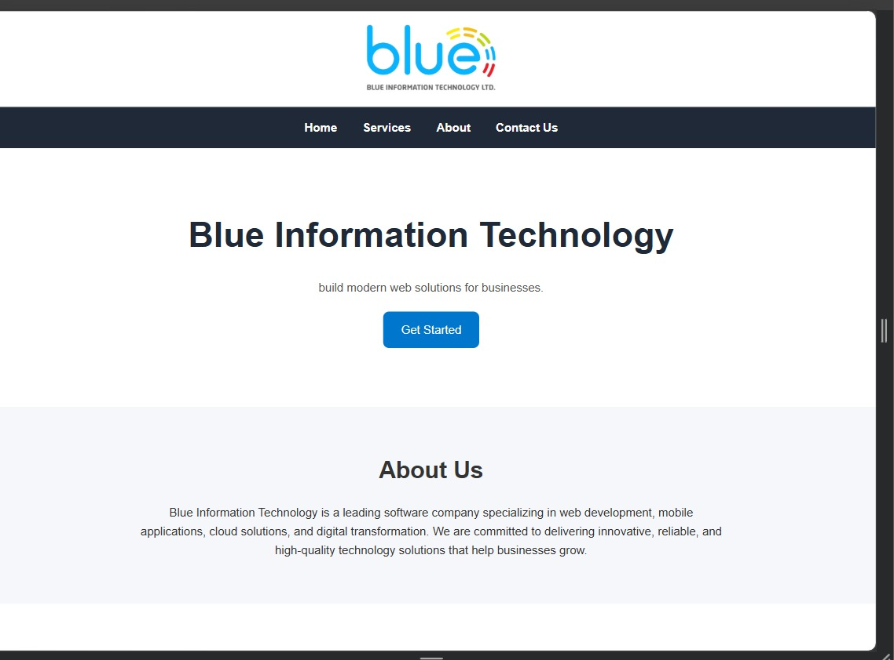

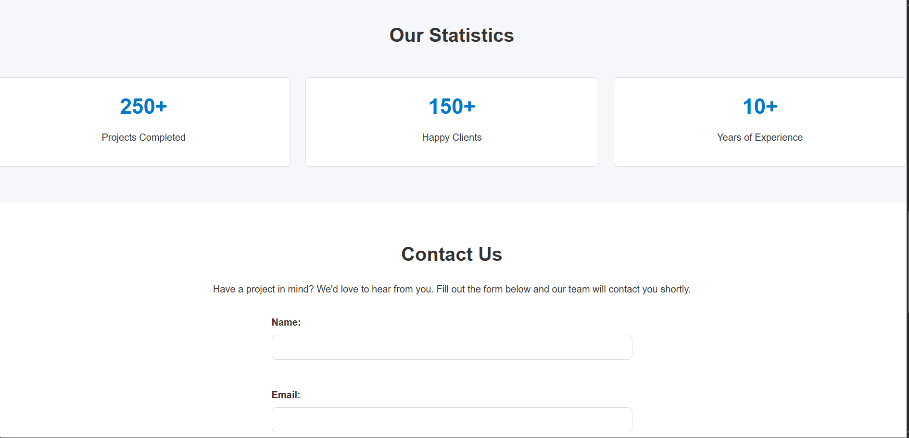

---

## Tablet

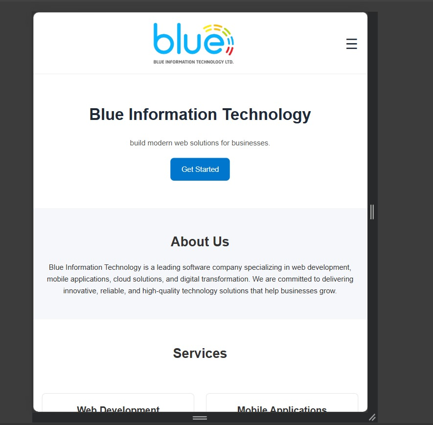

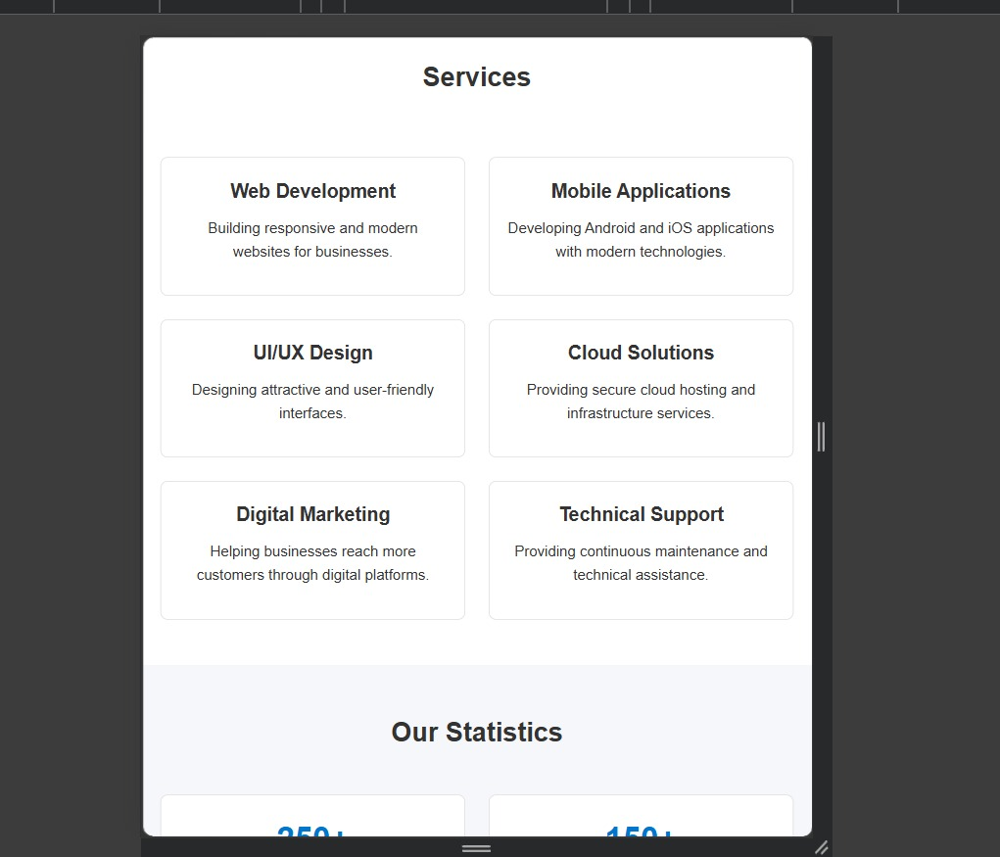

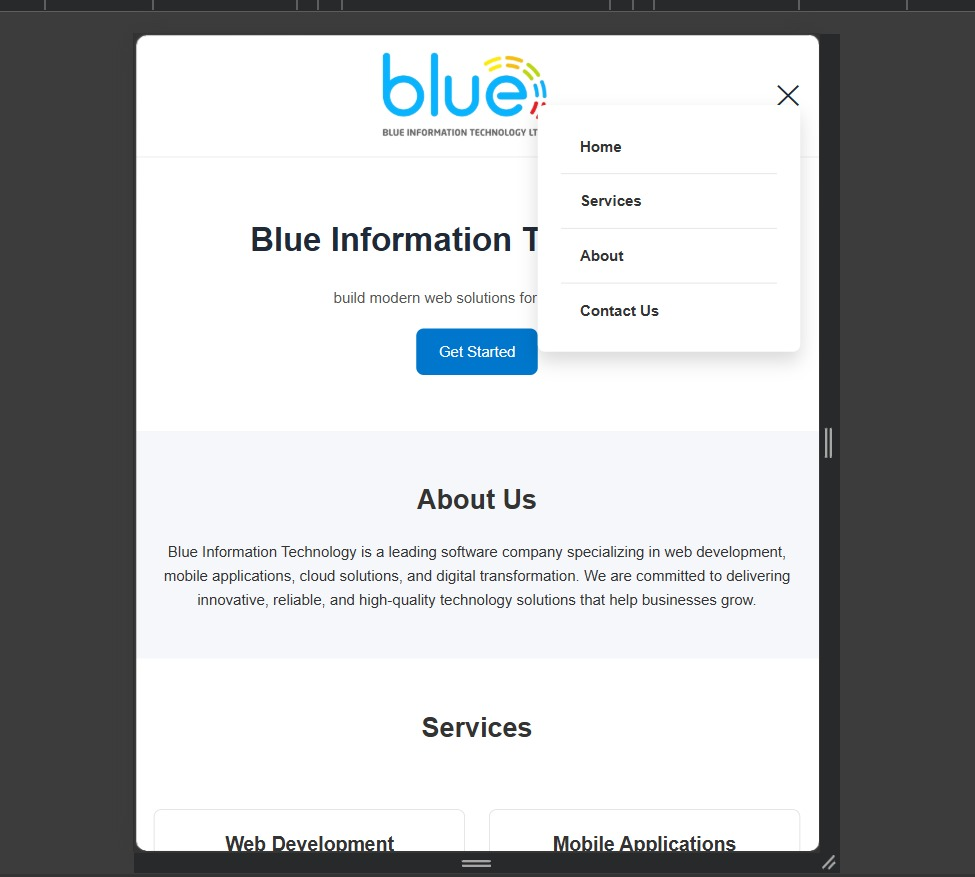

---

## Mobile

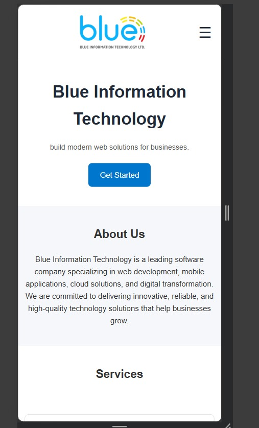

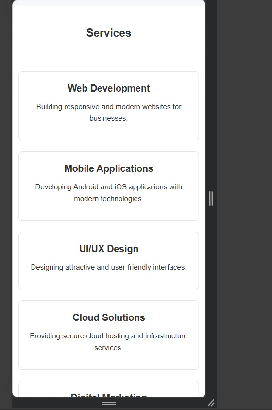

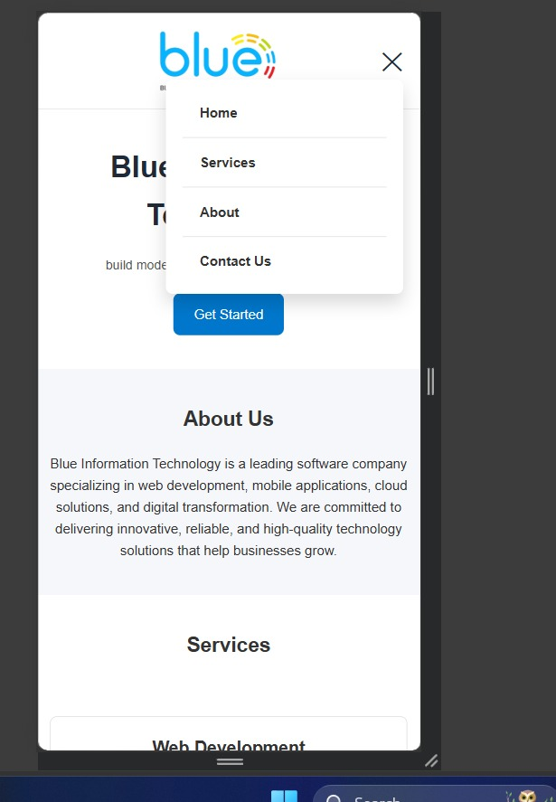

---

# JavaScript Features

## Form Validation

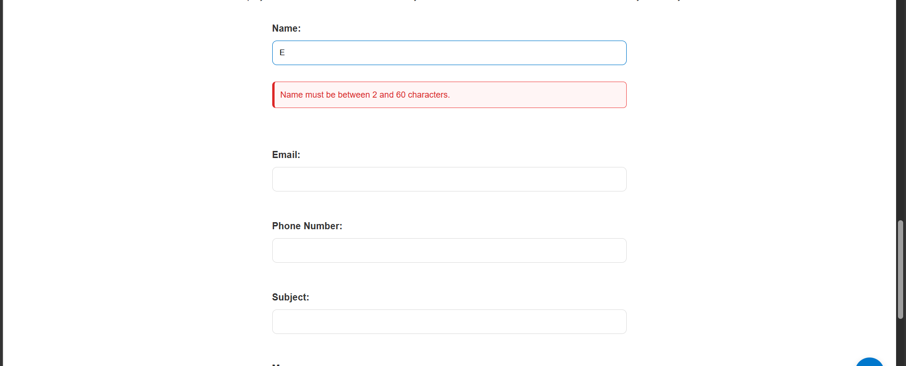

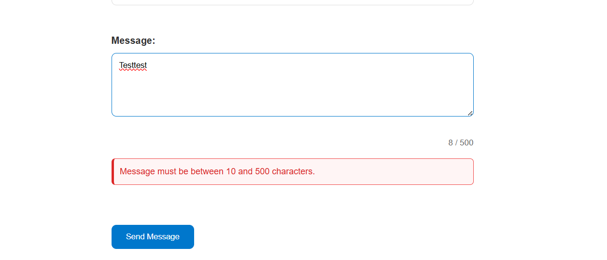

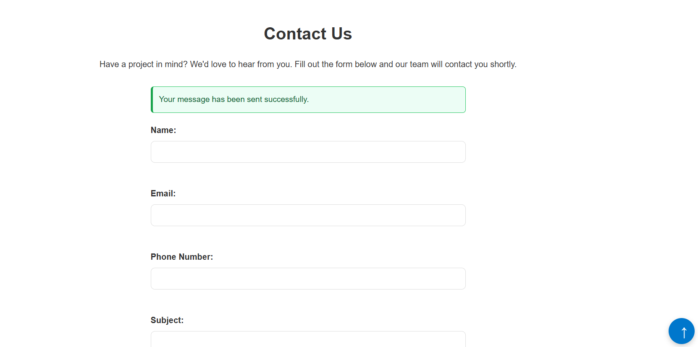

---

## Active Navigation & Back To Top

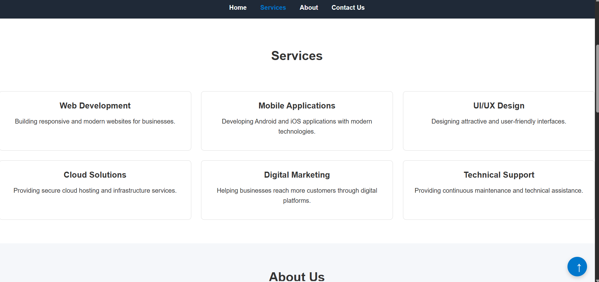

---

# Challenges

None